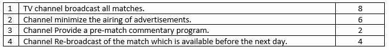

# Broadcast program

### Difficulty: Easy  
  
The opportunity to apply for the official broadcast of the 2022 Cricket Games is available on TV channels. You have to bid through the channels and apply for it. The bid will be given 7 days and the most suitable TV channels will be given 4 main conditions in addition to the bid limit and separate points will be awarded for those conditions.  

10 points and the bid should be between Rs 2 and 5 million. The selection for the next round is done. Organize a suitable program to find the channels that qualify for the second round.
  
If the tv channel achieves points related to the conditions is represented by "**y**" and otherwise "**n**".  

## Input Format

The submitted bid and answer to the questions using “**y**” or “**n**”.  
Bid and question answers separated by one space.

## Constraints
The bid should be between Rs 2-5 million. (2 ≤ Rs million ≤ 5)

## Output Format
Indicate whether tv channel qualify for the second round.  
If bid value is not valid print “**Rejected Bid value is low**”.  
If score less than 10 print “**Rejected Score below 10**”.  
If anything doesn't satisfy the given constraints, and no indication is given in the question, you may throw and exception. If you are unfamiliar with exceptions, just print an error message.  

## Sample Input

2.5 ynyn 

## Sample Output

Score: 10  
Qualifies

## Important
Feel free to use any programming language. (Eg: **Java** or **C++**)  
If the user's input is not correct, you should throw an exception. For those who are unfamiliar with exception handling, just print an Error message.  

#### Question was taken from BitCode V 3.0
Organized by  
<b>BITSA</b>  
Department of Information Systems  
Faculty of Management  
Rajarata University of Sri Lanka  
